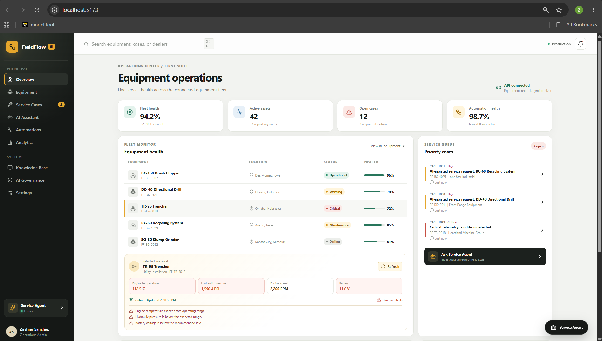
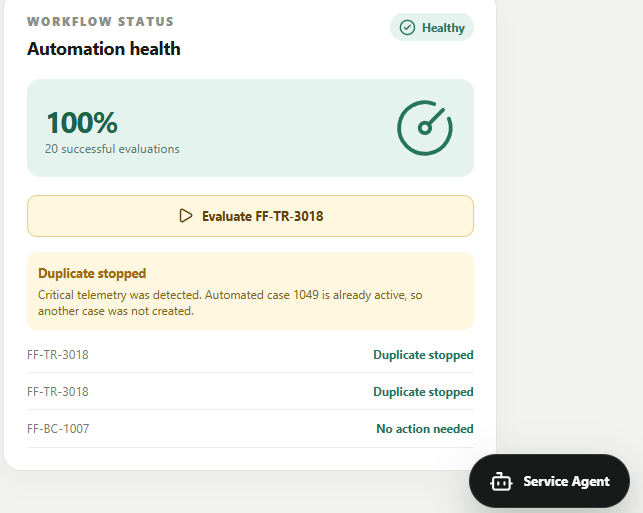
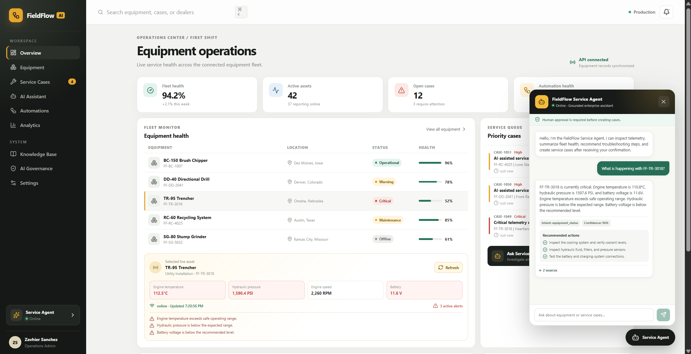
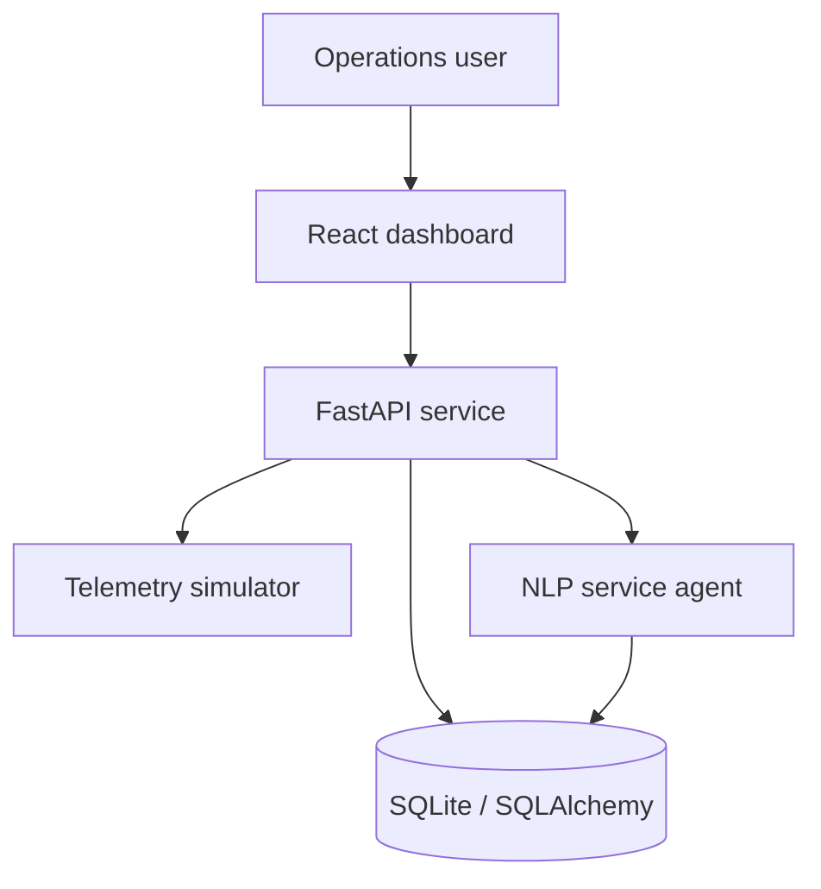

# FieldFlow AI

[](https://github.com/zavicodes-blip/fieldflow-ai/actions/workflows/ci.yml)

**An intelligent equipment service operations platform with live telemetry,
workflow automation, relational data, and an auditable AI service agent.**



## Overview

FieldFlow AI models an internal enterprise application used to monitor
equipment, investigate operational issues, coordinate service cases, and
automate repeatable support workflows.

The project combines a React operations dashboard with a FastAPI backend,
SQLAlchemy data models, simulated equipment telemetry, automated case routing,
and a grounded service agent.

## What This Project Demonstrates

- Full-stack application development
- REST API design and third-party integration patterns
- Relational data modeling and database relationships
- Intelligent workflow automation
- Natural-language intent classification
- Human-in-the-loop AI actions
- Duplicate-case prevention
- Responsible-AI monitoring and auditability
- Automated API testing
- Continuous integration with GitHub Actions
- Technical and support documentation

## Core Features

### Equipment Operations Dashboard

The dashboard provides:

- Fleet status and health monitoring
- Equipment locations and operational state
- Live telemetry readings
- Equipment alerts
- Persistent service cases
- Workflow health and history
- AI-assisted troubleshooting

### Live Telemetry

FieldFlow generates changing telemetry for five simulated equipment assets:

- Engine temperature
- Hydraulic pressure
- Engine RPM
- Battery voltage
- Fuel level
- Connectivity
- Health status
- Operational alerts

### Intelligent Automation

The automation engine evaluates equipment telemetry and:

1. Detects critical equipment conditions.
2. Checks for an existing automated case.
3. Creates and assigns a service case when required.
4. Prevents duplicate active cases.
5. Records every workflow decision in an audit audit table.



### Grounded Service Agent

The Service Agent can:

- Retrieve equipment information
- Inspect current telemetry
- Explain active alerts
- Recommend troubleshooting actions
- Summarize fleet health
- Create service cases after human approval
- Identify the data sources used
- Record intent, confidence, responses, and actions



Example questions include:

```text
What is happening with FF-TR-3018?
```

```text
Which machines need attention?
```

```text
Create a service case for FF-RC-4025.
```

Case creation always requires explicit confirmation.

## Architecture



Detailed architecture decisions are available in
[docs/architecture.md](docs/architecture.md).

## Technology

### Frontend

- React
- TypeScript
- Vite
- Recharts
- Lucide React
- CSS

### Backend

- Python
- FastAPI
- Pydantic
- SQLAlchemy
- SQLite
- Uvicorn

### Quality and Delivery

- Pytest
- Git
- GitHub
- GitHub Actions
- OpenAPI

## Data Model

FieldFlow uses four primary operational tables:

| Table | Purpose |
|---|---|
| `equipment` | Equipment identity, assignment, status, and health |
| `service_cases` | Persistent service issues and assignments |
| `automation_events` | Workflow decisions and results |
| `agent_interactions` | Agent messages, confidence, responses, and actions |

See the complete entity relationship diagram in
[docs/data-model.md](docs/data-model.md).

## API Endpoints

| Method | Endpoint | Purpose |
|---|---|---|
| `GET` | `/health` | Check API health |
| `GET` | `/api/equipment` | Retrieve all equipment |
| `GET` | `/api/equipment/{equipment_id}` | Retrieve one equipment record |
| `GET` | `/api/equipment/{equipment_id}/telemetry` | Generate live telemetry |
| `GET` | `/api/service-cases` | Retrieve service cases |
| `POST` | `/api/service-cases` | Create a service case |
| `POST` | `/api/automations/evaluate/{equipment_id}` | Evaluate automation rules |
| `GET` | `/api/automation-events` | Retrieve automation history |
| `POST` | `/api/agent/chat` | Send a message to the Service Agent |
| `GET` | `/api/agent/interactions` | Retrieve agent audit history |

The generated OpenAPI contract is stored at
[docs/fieldflow-openapi.json](docs/fieldflow-openapi.json).

## AI Safety and Governance

The agent uses a small Naive Bayes natural-language classifier combined with
deterministic action routing.

Safety controls include:

- Responses grounded in FieldFlow records and telemetry
- Visible source references
- Confidence monitoring
- Explicit confirmation before creating cases
- Duplicate-case prevention
- Persistent interaction auditing
- No destructive agent operations
- No production customer or personal data

Read the complete governance document in
[docs/ai-governance.md](docs/ai-governance.md).

## Automated Testing

The project currently contains **20 automated API tests** covering:

- Equipment retrieval
- Telemetry generation
- Alert detection
- Validation and error responses
- Service-case persistence
- Automation decisions
- Duplicate prevention
- Intent classification
- Agent grounding
- Human confirmation
- Agent audit history

Run the tests with:

```powershell
python -m pytest api\tests -v
```

GitHub Actions automatically runs the API tests and production dashboard build
on every push and pull request.

See [docs/testing-strategy.md](docs/testing-strategy.md) for the complete
testing approach.

## Run Locally

### Requirements

- Python 3.14 or newer
- Node.js 24 or newer
- npm
- Git

### Start the API

From the project root:

```powershell
python -m venv .venv
```

```powershell
.\.venv\Scripts\Activate.ps1
```

```powershell
python -m pip install -r requirements.txt
```

```powershell
python -m uvicorn api.app.main:app --reload
```

The API runs at:

```text
http://127.0.0.1:8000
```

Interactive API documentation:

```text
http://127.0.0.1:8000/docs
```

### Start the Dashboard

Open a second terminal:

```powershell
cd dashboard
```

```powershell
npm ci
```

```powershell
npm run dev
```

The dashboard runs at:

```text
http://localhost:5173
```

### Create a Production Build

```powershell
cd dashboard
```

```powershell
npm run build
```

## Project Structure

```text
fieldflow-ai/
├── .github/
│   └── workflows/
│       └── ci.yml
├── api/
│   ├── app/
│   │   ├── agent_intent.py
│   │   ├── agent_schemas.py
│   │   ├── agent_service.py
│   │   ├── automation_service.py
│   │   ├── database.py
│   │   ├── database_models.py
│   │   ├── main.py
│   │   └── telemetry_service.py
│   └── tests/
├── dashboard/
│   └── src/
│       ├── components/
│       └── services/
├── data/
├── docs/
├── screenshots/
├── requirements.txt
└── README.md
```

## Power Platform Alignment

The working implementation is code-based, but its components map directly to
common Microsoft Power Platform architecture:

| FieldFlow implementation | Power Platform equivalent |
|---|---|
| React dashboard | Power Apps |
| SQLAlchemy relational models | Dataverse tables |
| Python automation engine | Power Automate |
| FastAPI OpenAPI contract | Custom connector |
| Grounded Service Agent | Copilot Studio agent |
| Audit tables | Dataverse monitoring records |

This section describes architectural alignment and does not claim that the
current application is deployed through Power Platform.

## Documentation

- [System architecture](docs/architecture.md)
- [Data model](docs/data-model.md)
- [AI governance](docs/ai-governance.md)
- [Testing strategy](docs/testing-strategy.md)
- [OpenAPI contract](docs/fieldflow-openapi.json)

## Project Scope

FieldFlow AI is a portfolio development and testing project. Equipment,
telemetry, dealers, and service scenarios are simulated. Recommendations are
demonstrations and are not manufacturer-approved service instructions.

## Author

**Zavhier Sanchez**

- [GitHub](https://github.com/zavicodes-blip)
- [YouTube](https://www.youtube.com/@ZavCodes)