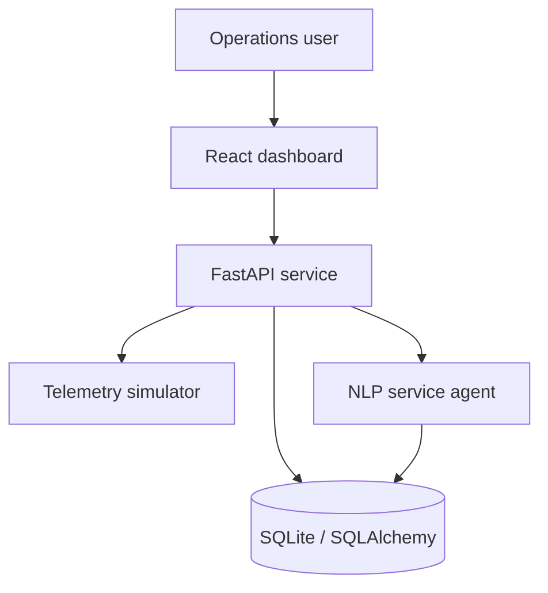
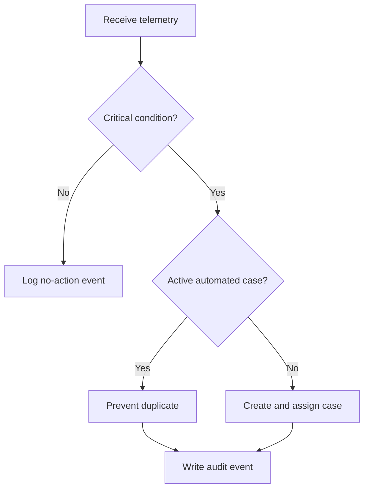
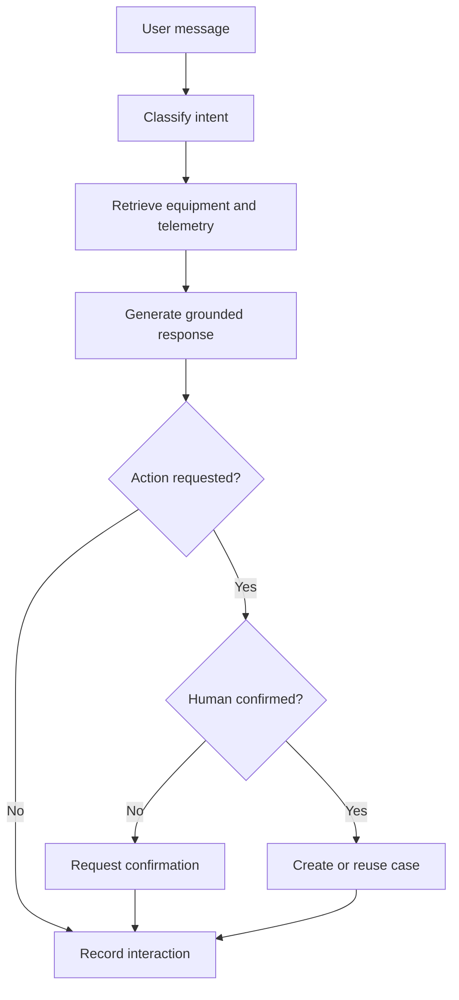

# FieldFlow AI Architecture

## Overview

FieldFlow AI is an equipment service operations platform that combines live
telemetry, relational service records, intelligent workflow automation, and a
grounded service agent.

The project models an internal enterprise application used by service
coordinators, technicians, and operations teams.

## System Architecture

## Main Components

| Component | Technology | Responsibility |
|---|---|---|
| Operations dashboard | React and TypeScript | Displays equipment, telemetry, service cases, automations, and the agent |
| Equipment API | FastAPI and Pydantic | Provides validated REST endpoints and OpenAPI documentation |
| Data layer | SQLAlchemy and SQLite | Stores equipment, cases, automation events, and agent interactions |
| Telemetry service | Python | Generates realistic equipment readings and operational alerts |
| Automation engine | Python and SQLAlchemy | Evaluates telemetry, creates cases, assigns dealers, and prevents duplicates |
| Service Agent | NLP intent classifier | Answers grounded questions and initiates approved service actions |
| Quality pipeline | Pytest and GitHub Actions | Runs automated API tests and verifies the production dashboard build |

## Telemetry Automation Flow

The automation engine evaluates the latest telemetry and records every
decision. Critical conditions create a service case only when an active
automated case does not already exist.

## Service Agent Flow

## Agent Safety Controls

The Service Agent follows several safeguards:

- Responses use FieldFlow equipment records and current telemetry.
- The response identifies the sources used.
- Every interaction records the detected intent and confidence score.
- Case creation requires explicit human confirmation.
- Duplicate AI-created cases are prevented.
- Agent actions are stored in an auditable database table.
- The agent cannot delete equipment or service records.

## Relational Data

The database contains four primary operational tables:

- `equipment`
- `service_cases`
- `automation_events`
- `agent_interactions`

Foreign keys connect service cases, automated decisions, and agent activity
back to the relevant equipment record.

## API Contract

FastAPI generates the OpenAPI contract stored at:

`docs/fieldflow-openapi.json`

The contract documents the equipment, telemetry, service-case, automation,
and Service Agent endpoints.

## Power Platform Alignment

The architecture can be mapped to Microsoft Power Platform:

| FieldFlow component | Power Platform equivalent |
|---|---|
| React operations dashboard | Power Apps canvas or model-driven app |
| SQLAlchemy database models | Dataverse tables and relationships |
| Automation engine | Power Automate cloud flows |
| FastAPI endpoints | Power Platform custom connector |
| Service Agent | Copilot Studio agent and actions |
| Audit-event tables | Dataverse monitoring and governance tables |

These are architectural mappings. The current working implementation is
code-based and does not claim deployment inside Power Platform.

## Development Boundaries

FieldFlow AI is a portfolio development and testing environment. Equipment
readings and organizations are simulated. The project does not connect to
production machinery, customer records, or personally identifiable data.