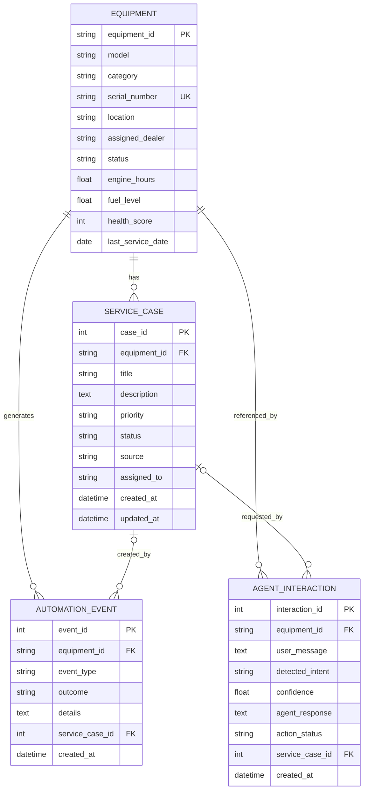

# FieldFlow Data Model

## Entity Relationship Diagram

## Design Decisions

- Equipment IDs are stable business identifiers.
- Serial numbers are unique to prevent duplicate assets.
- Service cases maintain foreign-key relationships to equipment.
- Automation events preserve every workflow decision.
- Agent interactions store intent, confidence, response, and action status.
- Agent and automation records can optionally reference created cases.
- Status and priority indexes support common service-queue queries.
- Equipment deletion cascades to related operational records.
- Case timestamps support auditability and SLA reporting.

## Dataverse Mapping

| SQLAlchemy model | Dataverse table |
|---|---|
| `EquipmentRecord` | Equipment |
| `ServiceCaseRecord` | Service Case |
| `AutomationEventRecord` | Automation Event |
| `AgentInteractionRecord` | Agent Interaction |

Dataverse lookup columns would replace the SQL foreign keys while preserving
the same one-to-many relationships.