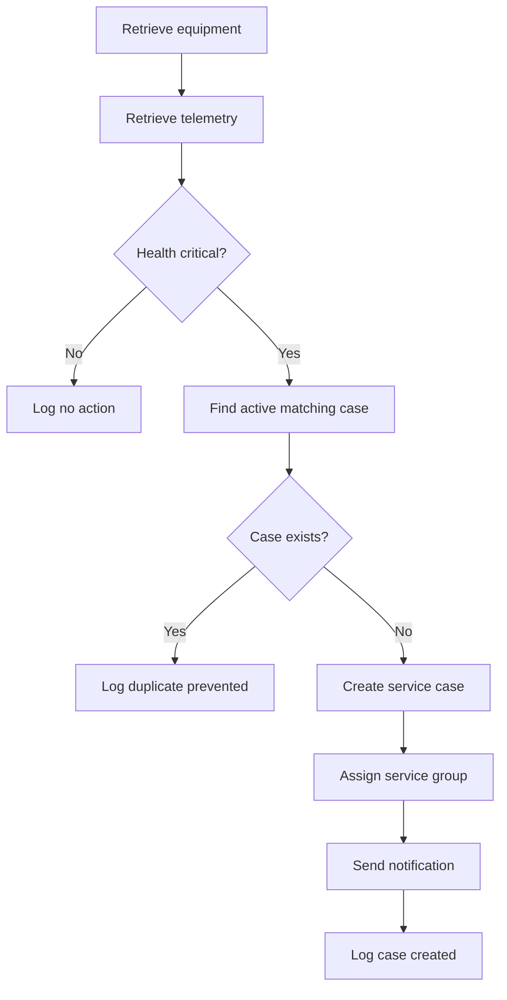

# Critical Equipment Case Routing Flow

## Business Goal

Automatically create and route a service case when equipment telemetry
reaches a critical state while preventing duplicate active cases.

## Proposed Platform

- Microsoft Power Automate
- Microsoft Dataverse
- FieldFlow custom connector
- Microsoft Teams or Outlook

## Trigger

The flow can use either:

- A scheduled recurrence that evaluates monitored equipment
- An HTTP or connector trigger initiated when telemetry is received

For the first implementation, a five-minute scheduled recurrence is
recommended because it is simple to monitor and retry.

## Flow Sequence



## Detailed Actions

### 1. Retrieve Equipment

Call the FieldFlow custom connector's `Get Equipment` action.

Required value:

- Equipment ID

### 2. Retrieve Telemetry

Call `Get Equipment Telemetry` for the selected equipment record.

Store:

- Equipment ID
- Recorded timestamp
- Health status
- Engine temperature
- Hydraulic pressure
- Battery voltage
- Alerts

### 3. Evaluate Health

Condition:

```text
health_status is equal to critical
```

If false, create an Automation Event with the outcome
`No Action Required`.

### 4. Search for an Existing Case

Use the Dataverse **List rows** action against the Service Case table.

The filter should locate records where:

- Equipment equals the current equipment
- Source equals Automation or AI Agent
- Case Status is not Resolved

Only the first matching row is required.

### 5. Prevent a Duplicate

If an active case exists:

1. Do not create another service case.
2. Create an Automation Event.
3. Set the outcome to `Duplicate Prevented`.
4. Associate the event with the existing case.
5. Record the telemetry snapshot.

### 6. Create a Service Case

If no matching case exists, add a Dataverse Service Case row.

Suggested values:

| Column | Value |
|---|---|
| Case Title | Critical telemetry detected |
| Equipment | Current equipment |
| Description | Combined telemetry alerts |
| Priority | Critical |
| Case Status | Open |
| Source | Automation |
| Assigned To | Equipment's assigned dealer or service group |
| SLA Due | Current time plus four hours |

### 7. Send a Notification

Send a Teams message or Outlook email containing:

- Case number
- Equipment ID and model
- Location
- Assigned service group
- Critical measurements
- Detected alerts
- Link to the Dataverse service case

### 8. Record the Outcome

Create an Automation Event with:

- Equipment
- Created service case
- Automation type
- Outcome
- Details
- Telemetry snapshot
- Timestamp

## Failure Handling

The flow should use separate Try, Catch, and Finally scopes.

### Try

Contains the primary connector and Dataverse operations.

### Catch

Runs when the Try scope fails:

- Capture the failed action
- Store the error message
- Create a failed Automation Event when Dataverse is available
- Notify the support owner after repeated failures

### Finally

Records completion information and duration for monitoring.

## Retry Policy

Transient connector operations should use exponential retry behavior.

Suggested configuration:

- Retry type: Exponential
- Retry count: 3
- Minimum interval: 10 seconds
- Maximum interval: 2 minutes

Validation failures and authorization failures should not be retried
indefinitely.

## Concurrency

Concurrency control should be enabled with a low degree of parallelism
to reduce the possibility of two flow runs creating duplicate cases for
the same equipment.

The Dataverse duplicate check should occur immediately before case
creation.

## Acceptance Criteria

- Healthy telemetry does not create a service case.
- Critical telemetry creates one correctly assigned service case.
- Repeated critical telemetry does not create duplicate active cases.
- Every run creates an auditable Automation Event.
- Connector failures follow the documented retry policy.
- Persistent failures notify the support owner.
- Notifications include the service case and equipment identifiers.
- Resolved cases allow a later critical event to create a new case.

## Local Implementation Evidence

The local FastAPI implementation demonstrates the same workflow through:

```text
POST /api/automations/evaluate/{equipment_id}
```

Automated tests verify:

- No action for healthy equipment
- Case creation for critical equipment
- Duplicate-case prevention
- HTTP 404 behavior for unknown equipment

The React Automation Health panel provides an interactive demonstration
of this workflow.